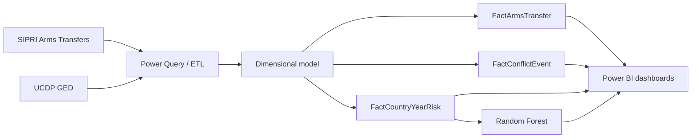

# Arms Flows and Conflicts — Geopolitical Analysis in Power BI

[Português](README.md) | [English](README.en.md)

A Business Intelligence solution for exploring spatial and temporal
relationships between international arms transfers and organized political
violence. The project combines data based on the SIPRI Arms Transfers Database
with the UCDP Georeferenced Event Dataset and presents the analysis through an
interactive Power BI report.

> This is an exploratory decision-support tool. Its results do not establish a
> causal link between arms imports and conflict intensity.

## What was developed

- Reproducible Power Query ETL with country, type and date normalization.
- A fact-constellation dimensional model that avoids many-to-many joins between
  transfers and events.
- Atomic arms/conflict facts and an aggregated country-year fact table.
- DAX measures for volumes, fatalities, delivery lag, risk and predictive
  evaluation.
- Eight dashboard pages: overview, arms flows, hotspots, temporal diagnosis,
  actors, risk/anomalies, prediction and validation.
- One-, two- and three-year lag variables for temporal analysis.
- A heuristic risk score and Random Forest regression for exploratory decision
  support.

## Analytical architecture



The arms data covers 2000–2023 and UCDP events cover 1989–2024. Combined
comparisons are most consistent over their overlapping period, 2000–2023.

## Main results

- The solution processed 10,520 transfer records and 385,918 conflict events;
  the final model contains 10,292 valid transfers and roughly 4,000 country-year
  observations.
- Arms flows and fatalities are both concentrated, but not necessarily in the
  same countries. They must first be analysed separately before temporal
  comparison.
- Historical conflict variables were more important to the Random Forest than
  isolated arms indicators.
- The predictive model achieved `R² = 0.64`, `MAE = 377` and `RMSE ≈ 3,000`,
  indicating moderate signal and difficulty with extreme conflicts.
- The initial load took 5 minutes and 17 seconds. Country-year pre-aggregation
  and removal of heavy columns reduced query cost.

## Explore the project

1. Install Power BI Desktop on Windows.
2. Open `Projeto_TAD_+conflitvisualization.pbix`.
3. Update the Power Query sources if the original CSV files are available.
4. Navigate with year, country, region, weapon-category and violence-type
   filters.
5. Review the validation page before interpreting rankings or predictions.

Additional material:

- [Technical report](Relatorio.pdf)
- [Web presentation](https://jfantunes03.github.io/TAD-Apresentation/#1)
- a link to the published Power BI version in `links.txt`; institutional
  authentication may be required.

## Repository structure

```text
arms-flows-conflict-analysis/
├── Projeto_TAD_+conflitvisualization.pbix
├── Relatorio.pdf
├── links.txt
├── README.md
└── README.en.md
```

The source datasets are not included as standalone files. The PBIX preserves
the model, transformations, measures and dashboards used in the project.

## Skills demonstrated

Power BI, Power Query, DAX, dimensional modelling, ETL, data quality,
geospatial analysis, time series, Random Forest and decision-support reporting.

## Academic context

Project presented in **José Cunha's** portfolio and developed for the Data
Analysis Technologies course in 2026. Full academic authorship is recorded in
the report.
