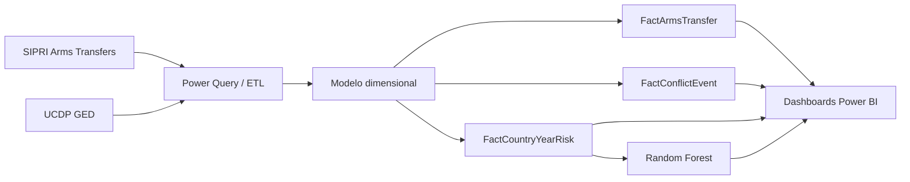

# Fluxos de Armas e Conflitos — Análise Geopolítica em Power BI

[Português](README.md) | [English](README.en.md)

Solução de Business Intelligence para explorar a relação espacial e temporal
entre transferências internacionais de armamento e violência política
organizada. O projeto combina dados baseados no SIPRI Arms Transfers Database
com o UCDP Georeferenced Event Dataset e apresenta a análise num relatório
interativo em Power BI.

> O objetivo é apoiar exploração e priorização de casos. Os resultados não
> demonstram causalidade entre importação de armas e intensidade de conflitos.

## O que foi desenvolvido

- ETL reproduzível em Power Query, com normalização de países, tipos de dados e
  datas.
- Modelo dimensional em constelação de factos, evitando relações many-to-many
  entre transferências e eventos.
- Factos atómicos para armas e conflitos e uma tabela agregada por país-ano.
- Medidas DAX para volumes, fatalidades, atrasos de entrega, risco e avaliação
  preditiva.
- Oito páginas de dashboard: visão geral, fluxos de armas, hotspots, diagnóstico
  temporal, atores, risco/anomalias, previsão e validação.
- Variáveis de atraso de um, dois e três anos para estudar relações temporais.
- Risk score heurístico e regressão Random Forest para apoio exploratório à
  decisão.

## Arquitetura analítica



Os dados de armas cobrem 2000–2023 e os eventos UCDP 1989–2024. A comparação
conjunta é mais consistente no período de sobreposição, entre 2000 e 2023.

## Principais resultados

- A solução processou 10 520 registos de transferências e 385 918 eventos de
  conflito; o modelo final contém 10 292 transferências válidas e cerca de
  4 000 observações país-ano.
- Os fluxos de armas e as fatalidades estão concentrados, mas nem sempre nos
  mesmos países, o que reforça a necessidade de analisar ambos separadamente
  antes da comparação temporal.
- As variáveis históricas de conflito foram os preditores mais relevantes no
  Random Forest, acima dos indicadores de armamento isolados.
- O modelo preditivo obteve `R² = 0,64`, `MAE = 377` e `RMSE ≈ 3 000`, mostrando
  sinal preditivo moderado e dificuldade perante conflitos extremos.
- A primeira carga demorou 5 minutos e 17 segundos. A pré-agregação por
  país-ano e a remoção de colunas pesadas reduziram o custo das consultas.

## Como explorar

1. Instalar Power BI Desktop num ambiente Windows.
2. Abrir `Projeto_TAD_+conflitvisualization.pbix`.
3. Atualizar as fontes no Power Query caso os CSV originais estejam disponíveis.
4. Navegar pelos filtros de ano, país, região, categoria de arma e tipo de
   violência.
5. Usar a página de validação antes de interpretar rankings ou previsões.

Também estão disponíveis:

- [Relatório técnico](Relatorio.pdf)
- [Apresentação web](https://jfantunes03.github.io/TAD-Apresentation/#1)
- ligação para a versão publicada do Power BI em `links.txt` — pode exigir
  autenticação institucional.

## Estrutura

```text
arms-flows-conflict-analysis/
├── Projeto_TAD_+conflitvisualization.pbix
├── Relatorio.pdf
├── links.txt
├── README.md
└── README.en.md
```

Os datasets de origem não estão incluídos como ficheiros independentes. O PBIX
preserva o modelo, as transformações, as medidas e os dashboards utilizados no
trabalho.

## Competências demonstradas

Power BI, Power Query, DAX, modelação dimensional, ETL, qualidade de dados,
análise geoespacial, séries temporais, Random Forest e comunicação de resultados
para apoio à decisão.

## Contexto académico

Trabalho desenvolvido no âmbito da unidade curricular de Tecnologias de Análise
de Dados, em 2026.
